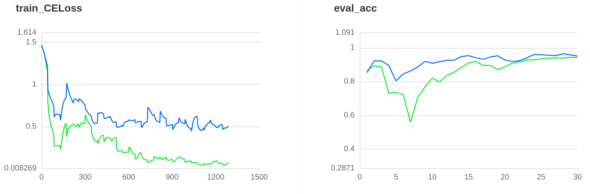
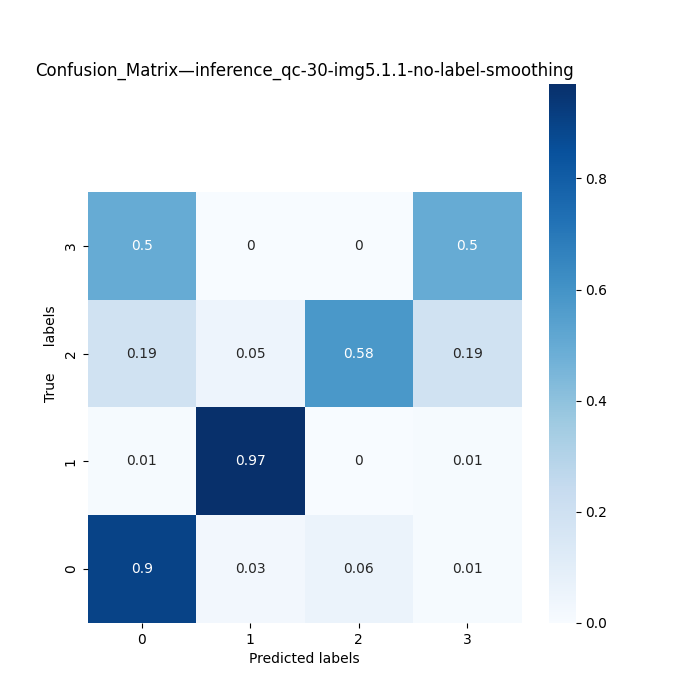
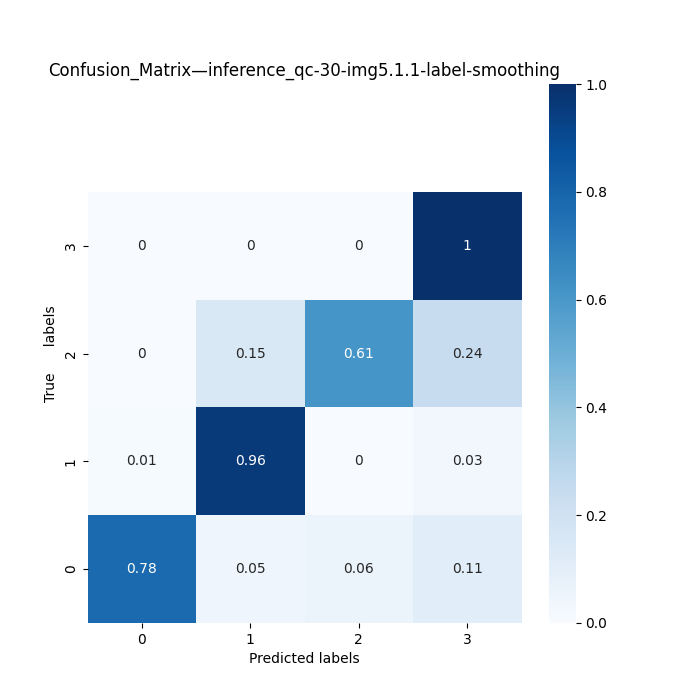
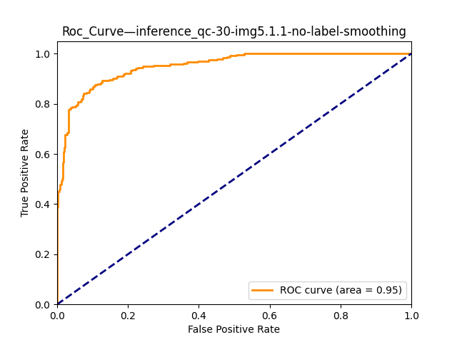
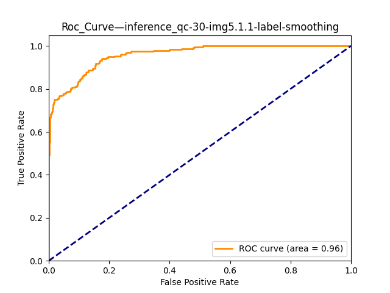

## Qualitycheck Application

`resnet50_vd` version info by qualitycheck datasets

| model       | version | epoch | label_smoothing | dataSet       | inference dir       |   acc| auc|              | onnx dir                        |
| ----------- | ------- | ----- | --------------- | ------------- | ------------------------------------ | ----|--- | -----| ------------------------------- |
| resnet50_vd | v1.0    | e30   | 0.1             | img5.1(0.5)   | inference_qc/30-img5.1              |  | | models/resnet50_vd_qc_1.0.onnx  |
| resnet50_vd | v1.0.1  | e30   | 0.1             | img5.1.1(0.8) | inference_qc/30-img5.1.1-epsilon-0.1 | | |                                 |
| resnet50_vd | v1.0.1  | e30   | 0               | img5.1.1(0.8) | inference_qc/30-img5.1.1            |  | | models/resnet50_vd_qc_1.0.1.onnx |
| resnet50_vd | v1.1  | e30   | 0.1               | img6.0(0.7) | inference_qc/30-img6.0            |  | | models/resnet50_vd_qc_6.0.onnx |
| resnet50_vd | v1.2  | e30   | 0.1               | img6.1.1(0.7) | inference_qc/30-img6.1.1          |  | | models/resnet50_vd_qc_1.2.onnx |
| resnet50_vd | v1.2.1  | e30   | 0.1               | img6.1.3(0.7) | inference_qc/30-img6.1.3          | 0.97 | 0.992 | models/resnet50_vd_qc_1.2.1.onnx |
| resnet50_vd | v1.2.2  | e30   | 0.1               | img6.1.4(0.7) | inference_qc/30-img6.1.4-classify    | 0.94 |    0.995   | models/resnet50_vd_qc_1.2.2.onnx |
| resnet50_vd | v1.2.3  | e30   | 0.1               | img6.1.7(0.7) | inference_qc/30-img6.1.7-classify    | 0.92 |    0.990   | models/resnet50_vd_qc_1.2.3.onnx |

## Test

| model       | version | dataSet       | inference dir       |   acc| auc|              | onnx dir                        |
| ----------- | ------- |  ------------- | ------------------------------------ | ----|--- | -----| ------------------------------- |
| resnet50_vd | v1.2.1  |  img6.1-test | inference_qc/30-img6.1.3          | 0.85  | 0.969 | models/resnet50_vd_qc_1.2.1onnx |
| resnet50_vd | v1.2.2  |  img6.1-test | inference_qc/30-img6.1.4-classify    | 0.82 |    0.97    | models/resnet50_vd_qc_1.2.2onnx |

## Performance

| model       | version | infer num       | sum infer time(ms)       |   infer time(ms) | fps|              |
| ----------- | ------- |  ------------- | ------------------------------------ | ----|--- | -----|
| resnet50_vd | v1.2.3  |  3500 | 20036         | 5.72  | 174 |


### Label smoothing


#### Confusion Matrix


#### Roc Curve



### Model export and convert

```bash
# train
python tools/train.py -c ./ppcls/configs/qualitycheck/ResNet/ResNet50_vd_qc.yaml -o Arch.pretrained=True

# infer
python tools/infer.py --config ./ppcls/configs/qualitycheck/ResNet/ResNet50_vd_qc.yaml  --override Global.pretrained_model=./output_qc/ResNet50_vd/best_model --override Infer.infer_imgs=dataset/img4.0/test/chaodi01/801_00007_image_3.jpg

# export
python tools/export_model.py --config ./ppcls/configs/qualitycheck/ResNet/ResNet50_vd_qc.yaml --override Global.pretrained_model=./output_qc/ResNet50_vd/best_model

# eval
python tools/eval_all.py  ./inference_qc/30-img6.1.5-classify ./dataset/img6.1.5/

# convert
paddle2onnx --model_dir=inference_qc/30-img6.1.6-classify  --model_filename=inference.pdmodel --params_filename=inference.pdiparams --save_file=models/resnet50_vd_qc_1.2.3.onnx --opset_version=10  --enable_onnx_checker=True

# feature map visualization
python ppcls/utils/feature_maps_visualization/fm_vis.py       -c 5     -p output_qc/ResNet50_vd/best_model      --show=True     --interpolation=1     --save_path="./output_qc/output.png"     --use_gpu=True  -i /home/wangmao/dataset/videos/test-0610/zhengchang/image-20220613095438972.jpg

```
